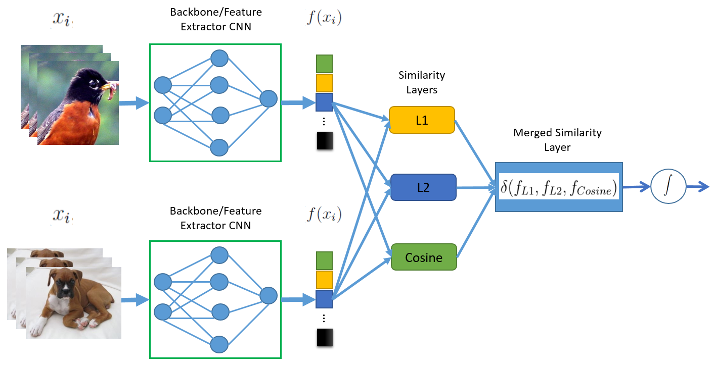

# MergedNET: A Simple Approach for One-Shot Learning in Siamese Networks based on Similarity Layers.
The project investigates similarity layers for the one-shot learning tasks and proposes two frameworks for merging these layers into a network called MergedNet. We show that MergedNet improved classification accuracy compared with the baselines on all the four datasets used in our experiment. Our MergedNet network trained on the miniImageNet dataset generalises to other datasets. 

# Dataset used in these experiments

<b>CUB-200-2011 </b> is a fine-grained dataset, which has 200 classes with a total of 11,788 images. It has been used in many fine-grain categorisation tasks and more recently to benchmark few-shot learning tasks. We used a similar dataset split (100, 50 and 50 classes for training, validation and testing, respectively) to what was proposed in Chen et al. 2019.

The <b>Caltech256 </b> dataset \cite{griffin2007caltech} contains 30,607 real-world images. It has 257 classes, but for few-shot learning, the clutter class is removed. We have used a dataset split similar to \cite{sung2018learning, vinyals2016matching, zhou2018deep, chen2019multi}, which is 150, 56 and 50 classes for training, validation and testing, respectively.

The <b>MiniImageNet</b> \cite{vinyals2016matching} contains 100 randomly selected classes from the original ImageNet dataset with 600 images per class. We split the dataset according to \cite{chen2019multi, li2020revisiting, sung2018learning, hilliard2018few}, 64 training, 16 validation and 20 test classes. We have chosen this dataset because it is complex and used for many one-shot learning tasks.

The<b>CIFAR-100</b> dataset \cite{krizhevsky2009learning} contains 100 classes with 600 images each. We followed the recommendation in \cite{sung2018learning, vinyals2016matching, zhou2018deep, chen2019multi} to split that dataset into 64 training, 16 validation and 20 testing classes, respectively, which is also consistent with other papers that evaluated their one-shot learning task with this dataset.

# Minimum dependencies required to use these codes:
Python 3.6.1

Keras 2.0.6

Tensorflow 1.3.0

Numpy 1.13.3

Pillow 5.1.0

Opencv 3.2.0

# Running the codes:
Use train.py to train the baseline models and train_lite.py can be used to train the "Lite" models

Use evaluate.py to evaluate the baseline models and evaluate_lite.py to evaluate the "Lite" models.

Most network parameters can be changed in the parameter file.

All CNN models are contained in the Models folder

Dataset not included but can be downloaded from http://www.robots.ox.ac.uk/~vgg/data/flowers/17/index.html
